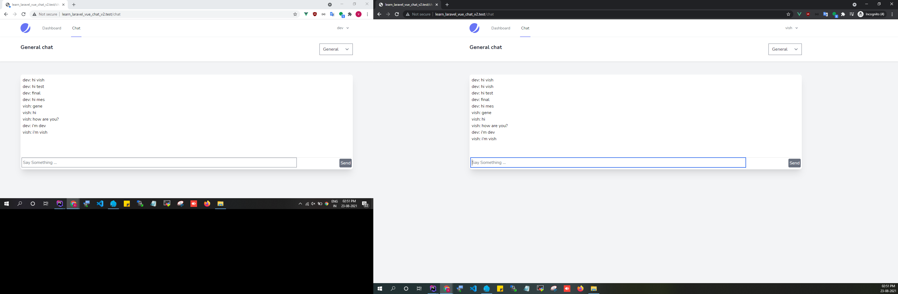
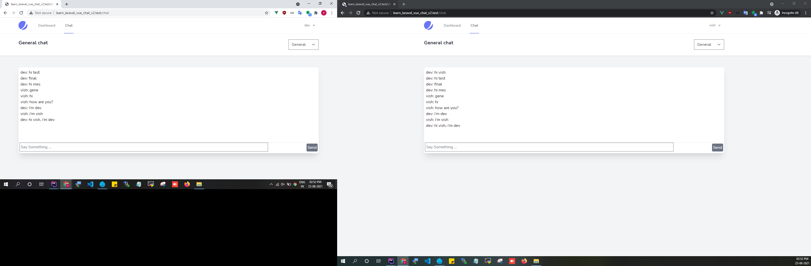

--
---

## Enable broadcast

    config\app.php

```text
App\Providers\BroadcastServiceProvider::class,
```

## .env

```text

BROADCAST_DRIVER=pusher

PUSHER_APP_ID=1247868
PUSHER_APP_KEY=cba9f63d3484b2f22a09
PUSHER_APP_SECRET=24f3150b8f04c90f09ce
PUSHER_APP_CLUSTER=ap2 

MIX_PUSHER_APP_KEY="${PUSHER_APP_KEY}"
MIX_PUSHER_APP_CLUSTER="${PUSHER_APP_CLUSTER}"

```

```text
composer require pusher/pusher-php-server "~4.0"
```

https://laravel.com/docs/7.x/broadcasting#driver-prerequisites
https://laravel.com/docs/8.x/broadcasting#installing-laravel-echo

```text
npm install --save-dev laravel-echo pusher-js
```

````text
import Echo from 'laravel-echo';

window.Pusher = require('pusher-js');

window.Echo = new Echo({
    broadcaster: 'pusher',
    key: process.env.MIX_PUSHER_APP_KEY,
    cluster: process.env.MIX_PUSHER_APP_CLUSTER,
    forceTLS: true
});

````

# webpack

```text
require('dotenv').config();
```

# EventServiceProvider.php

```text
protected $listen = [
        'App\Events\NewChatMessage' =>[
            'App\Listeners\SendChatMessageNotification'
        ]
    ];
```

# cmd: php artisan event:generate

    automatically create

```text
app/Events/NewChatMessage.php
app/Listeners/SendChatMessageNotification.php
```

# app/Events/NewChatMessage.php

```text
class NewChatMessage implements ShouldBroadcast
{
    //Todo: miss -> implements ShouldBroadcast
    
    public $chatMessage;
 
    public function __construct(ChatMessage $chatMessage)
    {
        $this->chatMessage = $chatMessage;
    }
    
    public function broadcastOn()
    {
        return new PrivateChannel('chat.' . $this->chatMessage->chat_room_id);
    }   
```

Controller new message store

```text
broadcast(new NewChatMessage($newMessage))->toOthers();
```

channels.php

```text

use Illuminate\Support\Facades\Auth;
use Illuminate\Support\Facades\Broadcast;

Broadcast::channel('chat.{roomId}', function ($user, $roomId) {
    if (Auth::check()) {
        return [
            'id' => $user->id,
            'name' => $user->name
        ];
    }
});


```

## Vue js

### container.vue

```vue

<script>
export default {
    methods: {
        //Todo: Step 3
        setRoom(room) {
            this.currentRoom = room;
            //Todo: Step 8 remove getMessages
            // this.getMessages();
        },
        
        connect() {
            if (this.currentRoom.id) {
                let vm = this;
                //Todo: Step 8.1
                this.getMessages();
                window.Echo.private("chat." + this.currentRoom.id)
                    .listen('.message.new', e => {
                        vm.getMessages();
                    });
            }
        }
    },
    watch() {
        currentRoom()
        {
            this.connect();
        }
    },
}
</script>
```
[Real-Time Chat with Laravel, Vue.js & Pusher](https://www.youtube.com/watch?v=CkRGJC0ytdU)




